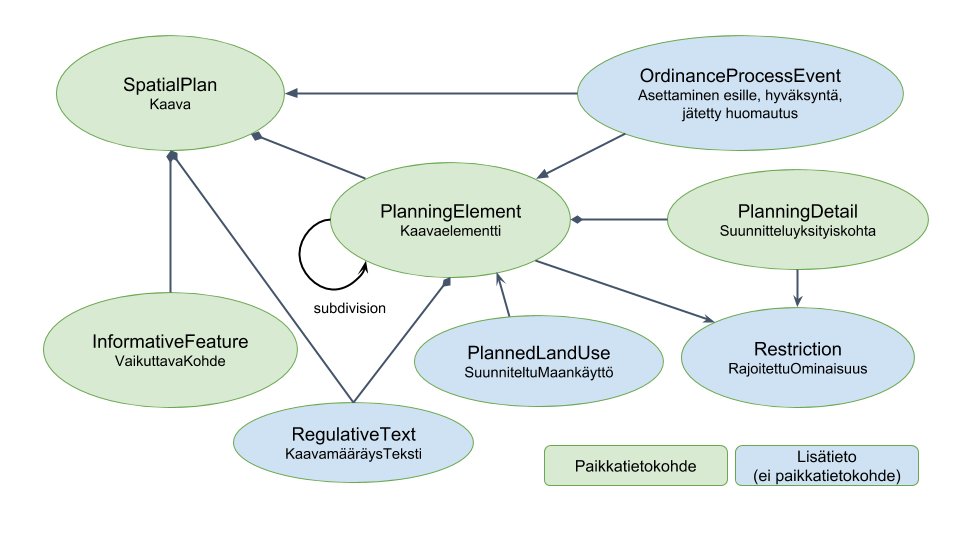
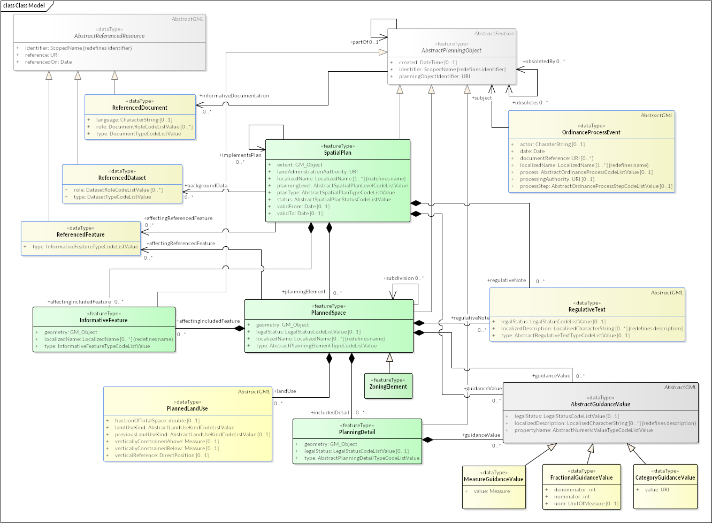
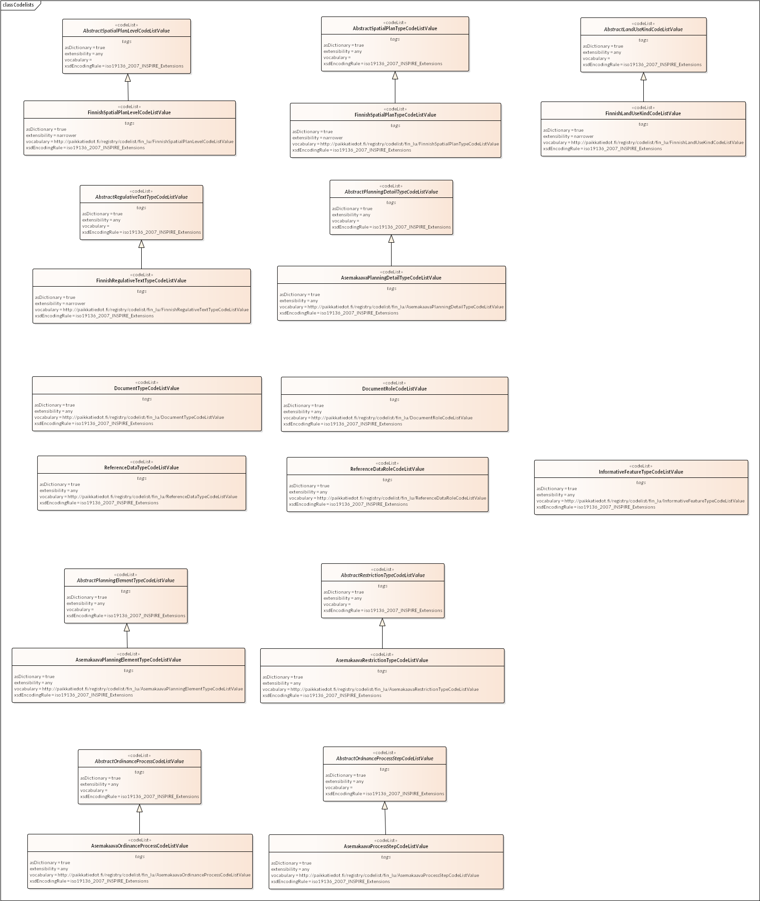

Tässä dokumentissa esitellään luonnos digitaalisen kaavoituksen kansalliseksi tietomalliksi. Tietomallin laatimisen lähtökohtana on ollut asemakaavoituksen tarpeet, mutta se on tarkoitus olla sovellettavissa myös muuntasoisen kaavoituksen tarpeisiin sopivilla koodilistojen valinnoilla.

Huomaa, että esitetty tietomalli on vielä luonnos ja mahdollisesti osin puutteellinen.

## Tietomallin yleiskuvaus

*Kuva 1: Kaavatietomallin keskeiset käsiteet*

Tietomallin luonnoksen keskeiset käsitteet ja niiden suomenkieliset vastineet on esitetty kuvassa 1. *SpatialPlan*-luokan mukainen paikkatietokohde sisältää koko asemakaavalle yhteiset ominaisuudet, sekä kaavan ulkorajan geometrian. SpatialPlan-kohteeseen liittyy kiinteästi nolla tai useampi *PlanningElement*-luokan mukainen paikkatietokohde, joiden geometriat kattavat yhdessä koko asemakaavan. Kukin PlanningElement kuvaa mahdollisesti moniosaisen 2D- tai 3D-geometrian rajaaman alueen kaavan sisällä. PlanningElement-kohde voi sisältää hierakisen alirakenteen subdivision-suhteen avulla. Asemakaavoituksessa PlanningElement-kohde voi olla tyypiltään esimerkiksi käyttötarkoitusalue, kortteli, ohjeellinen tontti, yleinen alue tai rakennusala. PlanningElement-kohteella on tyypillisesti nimi, jota käytetään esimerkiksi karttavisualisoinnissa.

PlanningElement-kohteisiin voi liittyä yksi tai useampi suunniteltu maankäyttötyyppi (*PlannedLandUse*).
PlannedLandUse voi olla pystysuuntaisesti rajoitettu, mikä mahdollistaa niin sanotun 2,5-ulotteisen asemakaavoituksen eri korkeuksilla yksinkertaisissa kaavoitustapauksissa, joissa ei haluta käyttää kolmiulotteisia PlanningElement-kohteiden geometrioita. PlannedLandUse-tieto voi myös sisältää tiedon siitä, kuinka suuri osuutta koko siihen liittyvän PlanningElement-kohteen pinta-alasta tai tilavuudesta ko. maankäyttötapa koskee. Oletusarvoisesti maankäyttö koskee koko liittyvää aluetta.

PlanningElement-kohteen sisällä tai reunalla voi sijaita kaavoitusyksityiskohtia kuvaavia paikkatietokohteita, jotka mallinnetaan *PlanningDetail*-luokan avulla. Esimerkkejä PlanningDetail-luokan tyypeistä asemakaavan tapauksessa ovat korttelin sivu, johon ko. korttelin rakennukset on rakennettava kiinni, sekä korttelia ympäröivä istutettava alue.

PlanningElement- ja PlanningDetail-kohteisiin voi liittyä eri tyyppisiä suunniteltua maankäyttöä ja rakentamista rajoittavia ominaisuuksia, jotka mallinnetaan *Restriction*-luokan avulla. Esimerkkejä asemakaavan Restriction-luokan instansseista ovat tehokkuusluku, rakennusten harjasuunta ja suurin mahdollinen kerrosluku. SpatialPlan- ja PlanningElement-kohteisiin voi liittyä myös sanallisesti kuvattuja kaavamääräyksiä (*RegulativeText*), joita ei ole ollut mahdollista tai käytännöllistä kuvata koneluettavaan muotoon käyttäen Restriction-luokan instanssien avulla, tai jotka SpatialPlan-luokan tapauksessa koskevat koko asemakaavaa. Näiden luonnollisella kielellä kuvattujen määräystekstien käyttämistä tulisi kuitenkin mahdollisuuksien mukaan välttää, sillä ne heikentävät kaavan koneellista tulkintakelpoisuutta.

*Kuva 2: UML-tietomalli*

Joitakin kaavan määräyksiä voidaan perustella olemassa olevilla paikkatietokohteilla, joista esimerkkejä ovat suojellut alueet tai olemassa olevan tie- ja rautatieverkoston kaavan suhteen relevantit osat. Ensisijaisesti nämä perustelevat kohteet pyritään liittämään kaavaan ulkoisten viittausten avulla (kuvan 2 UML-luokkakaavion ReferencedFeature-luokka). Mikäli viittausta ei voida tehdä käyttäen pysyväksi tiedettyä tunnusta viitattavan kohteen muuttumattomaan versioon, tulee kohteen perusteella luoda uusi kaavan tietomalliin sisällytettävä InformativeFeature-luokan mukainen paikkatietokohde.

Kaavoitusprosessiin kuuluu joukko tapahtumia, joista voidaan koostaa kaavan synty- ja muutosprosessien ajallinen kulku keskeisin osin. Nämä tapahtumat mallinnetaan kaavan tietomallissa OrdinanceProcessEvent-luokan instansseilla, jotka sisältävät perustiedot kustakin tapahtumasta, tapahtuman tekijän/toimeenpanijan nimen, sekä mahdollisia viittauksia tapahtumaan liittyviin ulkoisiin dokumentteihin. Tarkoitus ei ole toteuttaa asianhallintajärjestelmää kaavan tietomallin sisään, vaan kuvata kaavoitusprosessin keskeiset toteutuneet vaiheet ko. kaavan osalta. OrdinanceProcessEvent-luokan tapahtumatiedot täydentävät SpatialPlan-luokan kaavan tilatietoa ilmaisevaa status-ominaisuutta.

Kaavan laatimisen lähtöaineistoihin viitataan tietomallissa ReferencedDataset-luokan instansseilla (ks. kuva 2). Lähtöaineistoviittaus voi koskea esimerkiksi kaavoituksessa käytettyä pohjakartta-aineistoa, kaupunkimallin versiota tai nimettyä pistepilviaineistoa. Aineiston tunnuksen ja ulkoisen viittauksen lisäksi voidaan antaa rooli, jossa ko. aineistoa on kaavoituksessa hyödynnetty.

## Koodilistat ja kohteiden pehmeä tyypitys

Tietomallissa on hyödynnetty laajasti koodilistoja kohteiden ja lisätietojen tyypitykseen, ja jätetty monet luokat nimiltään melko yleisiksi. Tavoitteena on ollut luoda luokkarakenne, jonka avulla voidaan mallintaa tulevaisuuden kaavoitusta eri tasoilla ja sopeutua tuleviin laki- ja kaavoituskäytäntömuutoksiin. Ulkoisten koodilistojen käyttö mahdollistaa kaavoituksen yksityiskohtien määrittelyn sekä niiden rajoitetun ja hallitun muuttamisen tulevaisuuden tarpeita vastaavaksi: Halutusta koodilistasta voidaan julkaista uusi korjattu tai täydennetty versio, jota käyttäen uudet kaavat voivat hyödyntää tietomallin laajennettuja tai korjattuja ominaisuuksia, kuten uutta rajoittavaa ominaisuutta. Aiemmin laaditut kaavat viittaavat edelleen ko. koodilista laadintahetkellä käytössä olleeseen koodilistaan.

*Kuva 3: Kaavatietomallin koodilistat*

Tietomallin luonnoksessa ei ole laadittu sisältöä käytetyille koodilistoille, vaan ne määritellään ja dokumentoidaan Kuntapilotti-projektin toteutuksen aikana.

## Tietomallin GML-realisaatio

Tietomallin mukainen Geography Markup Language (GML) -sovellusskeema toteutetaan osana Kuntapilotti-projektia. GML-sovellusskeeman tulee olla Geometry Markup Language (GML) Simple Features –profiilin version 2.0 compliance level SF-1 –mukainen. Sovellusskeeman tulee perustua GML-versioon 3.2 tai uudempaan. Simple Features –profiilin käytöllä pyritään pitämään tietomallin tekninen käyttöönottokynnys ja digitaalisen kaavoituksen sovelluskehityskustannukset kohtuullisina, ja samaan aikaan saavuttamaan GML-tason yhteensopivuus kansainvälisten kaavatiedon julkaisun sovellusskeemojen, erityisesti INSPIRE-direktiivin Planned Land Use –skeeman, kanssa.
